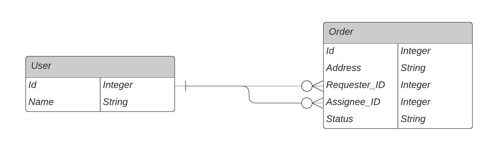

# Getting Started

  # What is orders-api?
  
  Orders-api is a Rails API that allows you to create and request orders.

  # How to run the application

  First you need to setup your environment.\
  Install ruby and rails following the instructions on the following link: \
  https://www.ruby-lang.org/en/documentation/installation/ \
  https://guides.rubyonrails.org/v5.0/getting_started.html#installing-rails

  Install postgresql and run it. Check the postgresql documentation for more information. https://www.postgresql.org/download/ 

  In the command line, run:
  
      bundle install
      bundle exec rails db:create
      bundle exec rails db:migrate
      bundle exec rails s -b 0.0.0.0

  Now you can access the api.

  ## Database ERD

  


  ## API documentation

  ### Create user
  Returns a json with the user information.

  * **URL**: /api/v1/users
  * **Method**: POST
  * **Data Params**
    **Required**
    `name=[String]`

  * **Success Response**
    * **Code:** 201
    * **Body**: `{ user: { id: 1, name: "John Doe" } }`

  * **Error Response**
    * **Code:** 422
    * **Body**: `{ errors: { name: ["can't be blank"] } }`

  * **Sample Call**:
    ```javascript
      axios.post('/api/v1/users', { name: 'John Doe' })
      .then(response => console.log(response.data))
      .catch(error => console.log(error.response.data));
    ```

  ### Fetch users
  Returns a json with the users information.

  * **URL**: /api/v1/users
  * **Method**: GET
  
  * **Success Response**
    * **Code:** 200
    * **Body**: `{ users: [{ id: 1, name: "John Doe" }, { id: 2, name: "Jane Doe" }] }`

  * **Sample Call**:
    ```javascript
      axios.get('/api/v1/users')
      .then(response => console.log(response.data))
      .catch(error => console.log(error.response.data));
    ```

  ### Create order
  Returns a json with the order information.

  * **URL**: /api/v1/orders
  * **Method**: POST
  * **Data Params**
    **Required**
    `order: { assignee_id: [Integer], address: [String] }`

  * **Success Response**
    * **Code:** 201
    * **Body**: `{ order: { id: 1, assignee_id: 1, address: "123 Main St", status: "pending", created_at: "2020-01-01T00:00:00.000Z", updated_at: "2020-01-01T00:00:00.000Z" } }`

  * **Error Response**
    * **Code:** 422
    * **Body**: `{ errors: { assignee_id: ["can't be blank"], address: ["can't be blank"] } }`

  * **Sample Call**:
    ```javascript
      axios.post('/api/v1/orders', { order: { assignee_id: 1, address: "123 Main St" } })
      .then(response => console.log(response.data))
      .catch(error => console.log(error.response.data));
    ```

  ### Fetch orders
  Returns a json with the orders information.

  * **URL**: /api/v1/orders
  * **Method**: GET
  
  * **Success Response**
    * **Code:** 200
    * **Body**: `{ orders: [{ id: 1, assignee_id: 1, address: "123 Main St", status: "pending", created_at: "2020-01-01T00:00:00.000Z", updated_at: "2020-01-01T00:00:00.000Z" }, { id: 2, assignee_id: 2, address: "456 Main St", status: "pending", created_at: "2020-01-01T00:00:00.000Z", updated_at: "2020-01-01T00:00:00.000Z" }] }`

  * **Sample Call**:
    ```javascript
      axios.get('/api/v1/orders', {
        headers: {
          'Authorization': `Bearer ${userId}`
        },
      })
      .then(response => console.log(response.data))
      .catch(error => console.log(error.response.data));
    ```

  ### Update order
  Returns a json with the order information.
  
  * **URL**: /api/v1/orders/:id
  * **Method**: PUT
  * **Data Params**
    **Required**
    `order: { order_id: [Integer], photos: [Blob Array] }`

  * **Success Response**
    * **Code:** 200
    * **Body**: `{ order: { id: 1, assignee_id: 1, address: "123 Main St", status: "completed", created_at: "2020-01-01T00:00:00.000Z", updated_at: "2020-01-01T00:00:00.000Z" } }`

  * **Error Response**
    * **Code:** 422
    * **Body**: `{ errors: { order_id: ["can't be blank"], photos: ["can't be blank"] } }`

  * **Sample Call**:
    ```javascript
      axios.put('/api/v1/orders/1', { order: { order_id: 1, photos: [...blobs] } })
      .then(response => console.log(response.data))
      .catch(error => console.log(error.response.data));
    ```

  # How to test the application

  Run the following commands in the command line:
  
  ```
  bundle exec rspec spec/
  ```